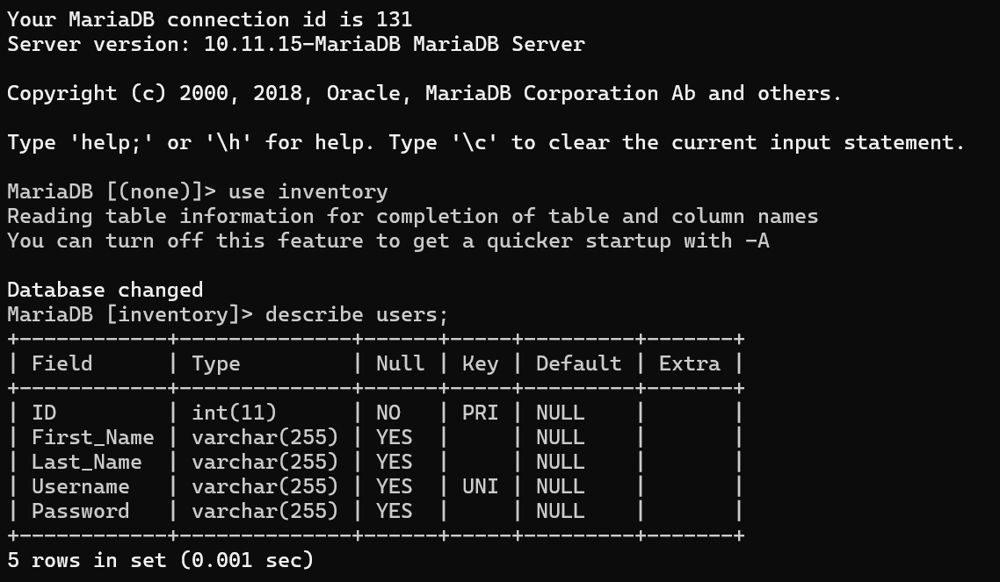
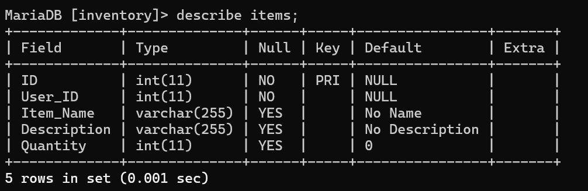
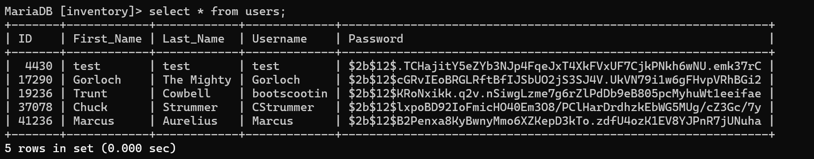
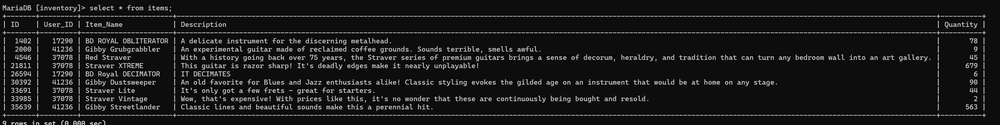

# 2nd Lt George Gordin - Z-Prefix Practical

[My Project is Live Here!](http://snakeserver.tech)

Hello! 

    This is 2nd Lt George Gordin, and I have been delighted to participate in this practical exam in
an effort to earn my Z-Prefix. This readme serves as a brief guide to my project, but if you have any other questions please feel free to contact me:

[Military Email](mailto:george.gordin@spaceforce.mil)
[Civilian Email](mailto:gcgordin@gmail.com)

## Table of Contents

- [Overview](#Overview)
- [Front-End](#Front-End)
- [Back-End / API](#Back-End)
- [Database](#Database)
- [Conclusion](#Conclusion)

## Overview

This repo contains the entirety of the project, which I call **BackOrder**, minus the database element which is running live on the server. I keep that server off and on while hobbying with various projects, but it should stay hosting this until I get word back about my assessment.

I have already added some users and data via testing, which I have made somewhat guitar-themed (a chief hobby of mine). Feel free to make accounts and perform CRUD actions on that live server.

## Front-End

I call the front-end piece of this project **servicewindow**, and you can see that it is a React application organized via Vite. I decided to have one top file to act as sort of the clearing house for the other rendered components. I felt like React was my weakest area of experience on the tech stack when starting this project, but I had a great time and really learned a ton.

Some supporting technology I used in the front-end were Tailwind and DaisyUI to simplify styling and help things look less horrible, as well as Axios to help organize API calls to the server.

It is being served by httpd running on Rocky Linux 10 on the VPS that I am leasing for hosting.

## Back-End

The back-end, which I call **backshelf**, is a Node.js server app using the regular old mysql module to interact with the DB. Additionally, I used a CORS module to help streamline same-origin requests and bcrypt to handle my passsword hashing. All of the hooks are in one file, but it was small enough that I forgave myself for it.

It is managed via PM2 on the VPS.

## Database

The database is running on mariaDB also installed on the VPS. The DB part of this project is simple, and I have included some screenshots just to demonstrate my attempt to adhere to the prescribed schema (and show the example data on the server as of now).

## Conclusion

Thank you, sincerely, for this amazing opportunity. I have been putting in the hours over these last few nights, but I have had a great time doing it. I look forward to the paired interview, and I hope you enjoy exploring this project of mine.